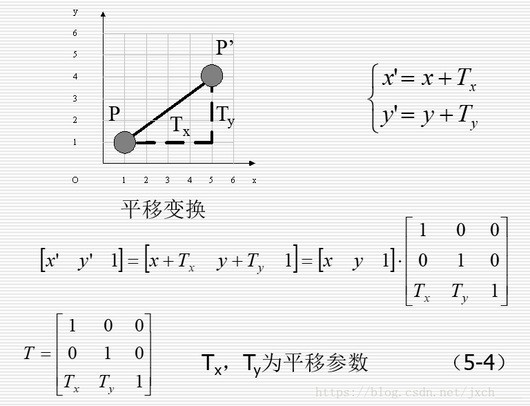
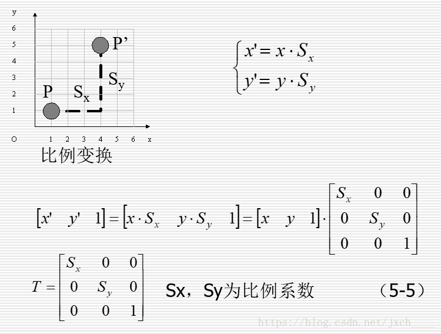
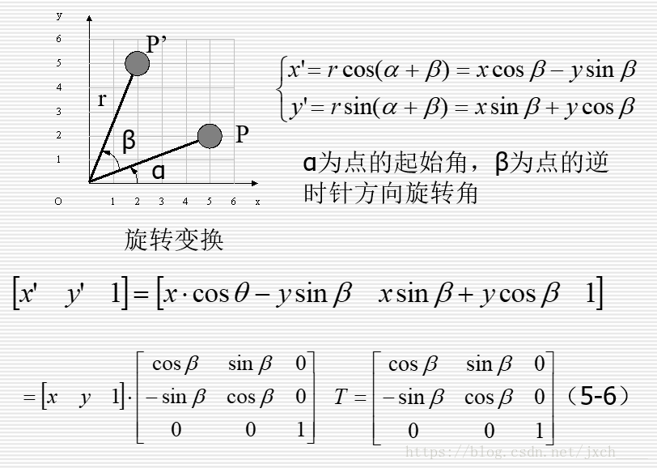
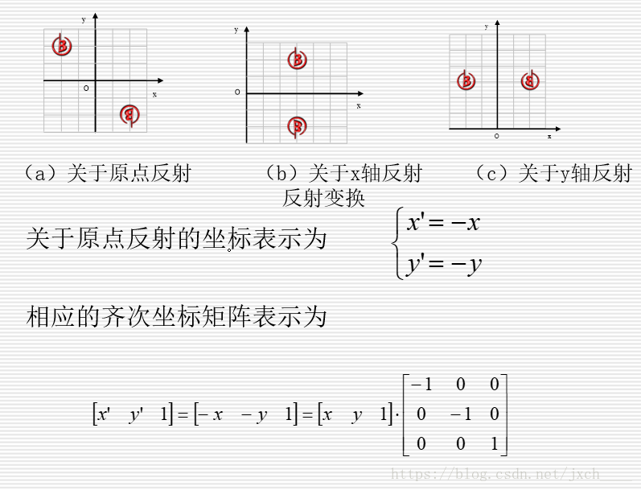
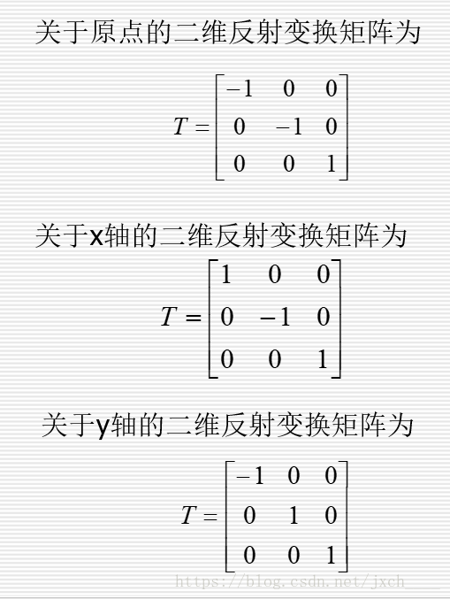
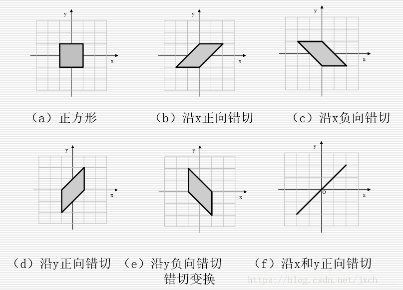
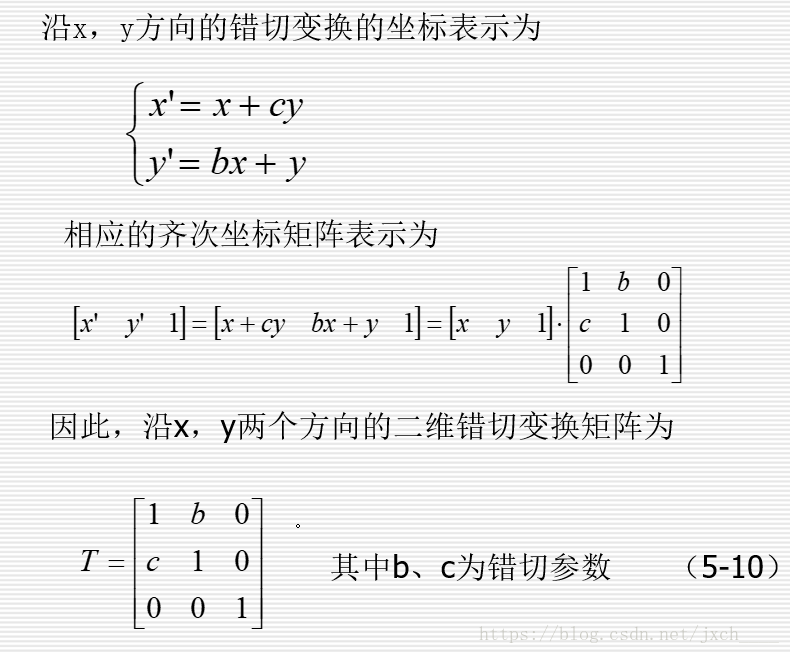
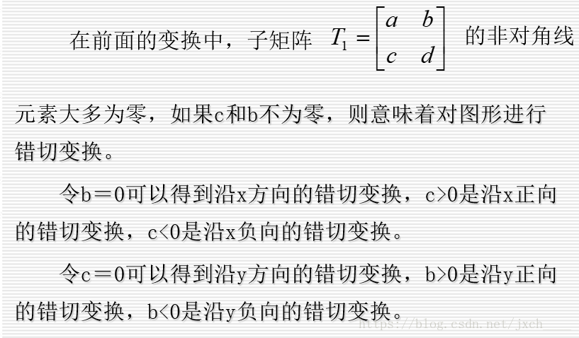
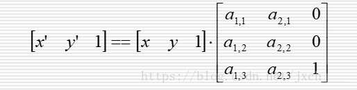

# 二维图形的基本几何变换矩阵
 
 二维图形基本几何变换是指**相对于坐标原点和坐标轴进行的几何变换**，包括**平移（Translate）**、**比例（Scale）**、**旋转（Rotate）**、**反射（Reflect）**和**错切（shear）**5种变换。物体变换是通过变换物体上每一个顶点实现的，因此以点的二维基本几何变换为例讲解二维图形基本几何变换矩阵 。

### 平移变换矩阵

### 比例变换矩阵

### 旋转变换矩阵

### 反射变换矩阵

### 错切变换矩阵

上面讨论的五种变换给出的都是点变换的公式，对于线框模型，图形的变换实际上都可以通过点变换来完成。例如直线段的变换可以通过对两个顶点坐标进行变换，连接新顶点得到变换后的新直线段；多边形的变换可以通过对每个顶点进行变换，连接新顶点得到变换后的新多边形。曲线的变换可通过变换控制多边形的控制点后，重新绘制曲线来实现。 
符合下面形式的坐标变换称为**二维仿射变换（Affine Transformation）**

仿射变换具有平行线变换成平行线，有限点映射到有限点的一般特性。平移、比例、旋转、反射和错切五种变换都是二维仿射变换的特例，任何一组二维仿射变换总可表示为这5种变换的组合