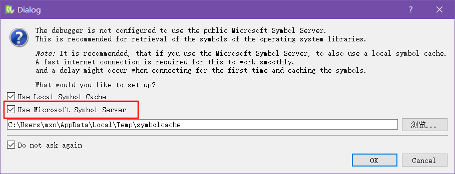
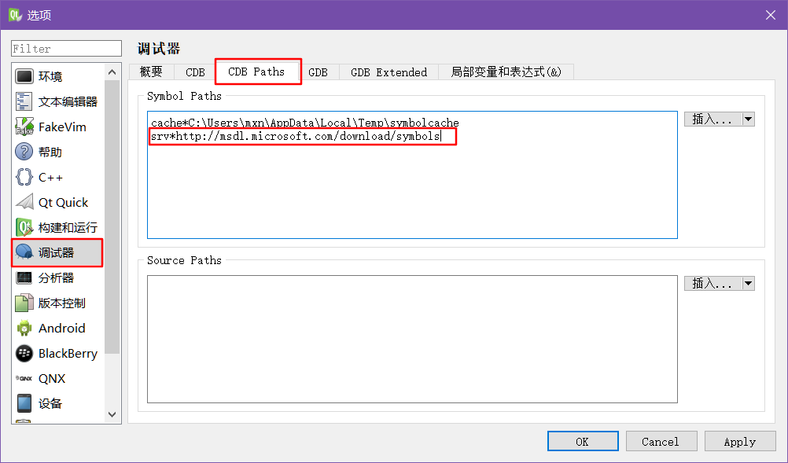

# QtCreator常见问题汇总
### 1. Windows中，使用VS编译器，QtCreator进行Debug时出现`Launching Debug`（如图1）的解决方法：

#### **一般原因：**
这是由于启动调试时，微软的CDB在后台从`srv*http://msdl.microsoft.com/download/symbols`加载服务器端的符号导致。
#### **正确的处理办法为：**
- 如果是该计算机配好开发环境后首次从QtCreator启动调试，一般会弹出调试器的对话框（如图2），此时一定要把红框部分取消勾选，然后勾选`Do not ask again`即可完美解决。

- 如果没有此窗口弹出，又迟迟无法启动调试，说明`Use Microsoft Symbol Server`选项在之前被不小心打开了，此时需要将其关闭，关闭方式为：打开QtCreator的设置面板，如图3所示，依次选择`调试器`->`CDB Paths`，从列表中将红框框选的那一行路径删除即可。
