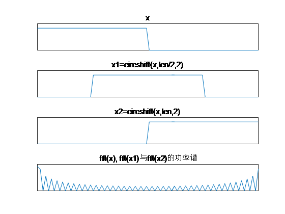

# 相关滤波

为本篇博文表述方便，特将前几篇中几个重要的公式在此一并贴出，不懂的可以去看前几篇博文。

$${\bf{w}} = {({{\bf{X}}^{\rm{T}}}{\bf{X}} + \lambda {\bf{I}})^{ - 1}}{{\bf{X}}^{\rm{T}}}{\bf{y}}\tag{1}$$
$${\bf{w}} = {({{\bf{X}}^{\rm{H}}}{\bf{X}} + \lambda {\bf{I}})^{ - 1}}{{\bf{X}}^{\rm{H}}}{\bf{y}}\tag{2}$$
$$\alpha  = {({\bf{K}} + \lambda {\bf{I}})^{ - 1}}{\bf{y}}\tag{3}$$
$${\bf{A}} + {\bf{B}} = C({\bf{a}} + {\bf{b}})\tag{4}$$
$${\bf{A}} \cdot {\bf{B}} = C\left( {{{\cal F}^{ - 1}}\left( {{\cal F}({\bf{a}}) \odot {\cal F}({\bf{b}})} \right)} \right)\tag{5}$$
$${{\bf{X}}^{\rm{T}}} = {\bf{F}} \cdot diag\left( {{{\cal F}^ * }({\bf{x}})} \right) \cdot {{\bf{F}}^{\rm{H}}}\tag{6}$$
$${{\bf{X}}^{ - 1}} = {\bf{F}} \cdot diag{\left( {{\cal F}({\bf{x}})} \right)^{ - 1}} \cdot {{\bf{F}}^{\rm{H}}}\tag{7}$$
$${\cal F}({\bf{Xy}}) = {{\cal F}^ * }({\bf{x}}) \odot {\cal F}({\bf{y}})\tag{8}$$

## 线性相关滤波
首先考虑一维样本，即一行（N个）图像像素，每个样本只有一维特征，当使用线性岭回归时，其解为式(1)，其中的${\bf{X}}$本质上是一个列向量。当引入循环矩阵之后，每个样本的特征被对应的扩展为由所有样本组成的循环向量，即${\bf{X}}$成为一个N×N的矩阵，其图形化表示如下图所示。

循环矩阵是联系样本时域空间与频域空间的纽带，引入循环矩阵之后，线性岭回归的解为式(2)，其${{\bf{X}}^{\rm{H}}}{\bf{X}}$项可做如下简化：

$$\displaylines{
  {{\bf{X}}^{\rm{H}}}{\bf{X}} = {\bf{F}} \cdot diag\left( {{{\cal F}^ * }({\bf{x}})} \right) \cdot {{\bf{F}}^{\rm{H}}} \cdot {\bf{F}} \cdot diag\left( {{\cal F}({\bf{x}})} \right) \cdot {{\bf{F}}^{\rm{H}}} \cr 
   = {\bf{F}} \cdot diag\left( {{{\cal F}^ * }({\bf{x}})} \right) \cdot diag\left( {{\cal F}({\bf{x}})} \right) \cdot {{\bf{F}}^{\rm{H}}} \cr 
   = {\bf{F}} \cdot diag\left( {{{\cal F}^ * }({\bf{x}}) \odot {\cal F}({\bf{x}})} \right) \cdot {{\bf{F}}^{\rm{H}}} \cr} $$
可以看出，${{\bf{X}}^{\rm{H}}}{\bf{X}}$项也是循环矩阵，其中${{\cal F}^ * }({\bf{x}}) \odot {\cal F}({\bf{x}})$项在信号处理领域称为自相关（auto-correlation）。考虑到单位矩阵${\bf{I}}$是对角阵，${\bf{F}}$是酉矩阵，根据循环矩阵的性质，则可继续简化如下：

$$\displaylines{
  {\bf{w}} = {({{\bf{X}}^{\rm{H}}}{\bf{X}} + \lambda {\bf{I}})^{ - 1}}{{\bf{X}}^{\rm{H}}}{\bf{y}} \cr 
   = {\left( {{\bf{F}} \cdot diag\left( {{{\cal F}^ * }({\bf{x}}) \odot {\cal F}({\bf{x}})} \right) \cdot {{\bf{F}}^{\rm{H}}} + \lambda {\bf{I}}} \right)^{ - 1}} \cdot {\bf{F}} \cdot diag\left( {{{\cal F}^ * }({\bf{x}})} \right) \cdot {{\bf{F}}^{\rm{H}}} \cdot {\bf{y}} \cr 
   = {\left( {{\bf{F}} \cdot diag\left( {{{\cal F}^ * }({\bf{x}}) \odot {\cal F}({\bf{x}}) + \lambda } \right) \cdot {{\bf{F}}^{\rm{H}}}} \right)^{ - 1}} \cdot {\bf{F}} \cdot diag\left( {{{\cal F}^ * }({\bf{x}})} \right) \cdot {{\bf{F}}^{\rm{H}}} \cdot {\bf{y}} \cr 
   = {\bf{F}} \cdot diag{\left( {{{\cal F}^ * }({\bf{x}}) \odot {\cal F}({\bf{x}}) + \lambda } \right)^{ - 1}} \cdot {{\bf{F}}^{\rm{H}}} \cdot {\bf{F}} \cdot diag\left( {{{\cal F}^ * }({\bf{x}})} \right) \cdot {{\bf{F}}^{\rm{H}}} \cdot {\bf{y}} \cr 
   = {\bf{F}} \cdot diag\left( {{{{{\cal F}^ * }({\bf{x}})} \over {{{\cal F}^ * }({\bf{x}}) \odot {\cal F}({\bf{x}}) + \lambda }}} \right) \cdot {{\bf{F}}^{\rm{H}}} \cdot {\bf{y}} \cr} $$
根据式（8）对将$\bf{w}$转换到频域得：

$$\displaylines{
  {\cal F}({\bf{w}}) = {\left( {{{{{\cal F}^ * }({\bf{x}})} \over {{{\cal F}^ * }({\bf{x}}) \odot {\cal F}({\bf{x}}) + \lambda }}} \right)^ * } \odot {\cal F}({\bf{y}}) \cr 
   = {{{\cal F}({\bf{x}}) \odot {\cal F}({\bf{y}})} \over {{\cal F}({\bf{x}}) \odot {{\cal F}^ * }({\bf{x}}) + \lambda }} \cr}\tag{9} $$
式（9）即为所求的线性岭回归的解，由于该解在频域空间，而且涉及到样本频谱的相关运算，故该算法通常又被称作“相关滤波”，该解被称作“相关滤波器”。可以看出，该解的求解过程巧妙的借用了DFT把时域内矩阵的乘法与求逆运算转换到频域，变成了矩阵元素之间的对位运算。时域内求解${\bf{w}}$的时间复杂度为$O({N^3})$，当使用FFT时，该求解过程的时间复杂度则为$O(N\log N)$，在计算速度上有质的提升，而这也是相关滤波器能实现高速跟踪的核心所在。

## 核相关滤波
考虑使用核岭回归的情况，首先要构造核矩阵${\bf{K}}$，而且为了充分利用循环矩阵的性质实现快速计算，核矩阵${\bf{K}}$必须是循环矩阵。
根据核函数的定义：${{\bf{K}}_{ij}} = \kappa ({{\bf{x}}_i},{{\bf{x}}_j}) = \left\langle {\varphi ({{\bf{x}}_i}),\varphi ({{\bf{x}}_j})} \right\rangle$ ，其中${{\bf{x}}_i}$表示第$i$个样本。在由一维样本${\bf{x}}$生成的循环矩阵${\bf{X}}$中，${{\bf{x}}_i}$泛化为${\bf{X}}$的第$i$行元素。则${\bf{K}}$的第$i$行元素为：${{\bf{K}}_i} = \kappa ({{\bf{x}}_i},{\bf{x}}) = \left\langle {\varphi ({{\bf{x}}_i}),\varphi ({\bf{x}})} \right\rangle$，即${\bf{X}}$的所有行元素与第$i$行元素在由映射函数$\varphi ( \cdot )$定义的希尔伯特空间中的内积。${\bf{K}}$的每一行元素都是遍历了${\bf{X}}$中的所有元素生成的，只是顺序有所不同，故核矩阵${\bf{K}}$必定是循环矩阵。
根据循环矩阵的性质，对式（3）进行简化：

$$\displaylines{
  {\bf{\alpha }} = {({\bf{K}} + \lambda {\bf{I}})^{ - 1}}{\bf{y}} \cr 
   = {\left( {{\bf{F}} \cdot diag\left( {{\cal F}({{\bf{k}}^{{\bf{xx}}}})} \right) \cdot {{\bf{F}}^{\rm{H}}} + \lambda {\bf{I}}} \right)^{ - 1}} \cdot {\bf{y}} \cr 
   = {\bf{F}} \cdot diag{\left( {{\cal F}({{\bf{k}}^{{\bf{xx}}}}) + \lambda } \right)^{ - 1}} \cdot {{\bf{F}}^{\rm{H}}} \cdot {\bf{y}} \cr} $$
其中，${{\bf{k}}^{{\bf{xx}}}}$表示由一维样本${\bf{x}}$生成的自相关核向量，根据式（8），则有：

$$\displaylines{
  {\cal F}({\bf{\alpha }}) = {\left( {{1 \over {{\cal F}({{\bf{k}}^{{\bf{xx}}}}) + \lambda }}} \right)^ * } \odot {\cal F}({\bf{y}}) \cr 
   = {{{\cal F}({\bf{y}})} \over {{\cal F}({{\bf{k}}^{{\bf{xx}}}}) + \lambda }} \cr} \tag{10}$$
常见的具有内积形式的核函数都可满足要求，如线性函数，多项式函数，径向基函数，其核向量的时域与频域表达式分别如下： 

### 1.线性核函数

$$\left\{ {\matrix{
  {{{\bf{k}}^{{\bf{xz}}}} = \kappa ({\bf{x}},{\bf{z}}) = {{\bf{x}}^{\rm{T}}}{\bf{z}}} \cr 
  {{\cal F}({{\bf{k}}^{{\bf{xz}}}}) = {{\cal F}^ * }({\bf{x}}) \odot {\cal F}({\bf{z}})} \cr 
 } } \right. \tag{11}$$
其中，${\bf{z}}$表示待检测样本，${\bf{x}}$表示训练样本，${{\cal F}^ * }({\bf{x}}) \odot {\cal F}({\bf{z}})$项在信号处理领域称为互相关（cross-correlation），${{\bf{k}}^{{\bf{xz}}}}$表示${\bf{x}}$与${\bf{z}}$的互相关核，一般在样本${\bf{z}}$的检测阶段采用，而在样本的训练阶段，如式(10)所示，则取样本${\bf{x}}$的自相关核，即${{\bf{k}}^{{\bf{xx}}}}$形式。此处为避免样本的混淆，统一采用${{\bf{k}}^{{\bf{xz}}}}$表示核向量。

### 2.多项式核函数

$$\left\{ {\matrix{
  {{{\bf{k}}^{{\bf{xz}}}} = \kappa ({\bf{x}},{\bf{z}}) = {{\left( {{{\bf{x}}^{\rm{T}}}{\bf{z}} + a} \right)}^b}} \cr 
  {{\cal F}({{\bf{k}}^{{\bf{xz}}}}) = {{\left( {{{\cal F}^ * }({\bf{x}}) \odot {\cal F}({\bf{z}}) + a} \right)}^b}} \cr 
 } } \right.\tag{12}$$

### 3.径向基核函数
径向基核函数形式为${{\bf{k}}^{{\bf{xz}}}} = \kappa ({\bf{x}},{\bf{z}}) = h\left( {{{\left\| {{\bf{x}} - {\bf{z}}} \right\|}^2}} \right)$，通常使用高斯核函数代替

$$\left\{ {\matrix{
  {{{\bf{k}}^{{\bf{xz}}}} = \kappa ({\bf{x}},{\bf{z}}) = \exp \left( { - {1 \over {{\sigma ^2}}}\left( {{{\left\| {\bf{x}} \right\|}^2} + {{\left\| {\bf{z}} \right\|}^2} - 2{{\bf{x}}^T}{\bf{z}}} \right)} \right)} \cr 
  {{\cal F}({{\bf{k}}^{{\bf{xz}}}}) = {\cal F}\left( {\exp \left( { - {1 \over {{\sigma ^2}}}\left( {{{\left\| {\bf{x}} \right\|}^2} + {{\left\| {\bf{z}} \right\|}^2} - 2{{\cal F}^{ - 1}}\left( {{{\cal F}^ * }({\bf{x}}) \odot {\cal F}({\bf{z}})} \right)} \right)} \right)} \right)} \cr 
 } } \right.\tag{13}$$

考虑使用线性核函数的情况，将其代入式（10）得：

$${\cal F}({\bf{\alpha }}) = {{{\cal F}({\bf{y}})} \over {{\cal F}({\bf{x}}) \odot {{\cal F}^ * }({\bf{x}}) + \lambda }}$$
由于${\bf{\alpha }}$是${\bf{w}}$在对偶空间的表示，二者存在以下关系：

$${\bf{w}} = \sum\limits_{i = 1}^N {{\alpha _i}\varphi ({{\bf{x}}_i})}  = \sum\limits_{i = 1}^N {{\alpha _i}{{\bf{x}}_i}}  = {{\bf{X}}^{\rm{T}}}{\bf{\alpha }}$$
根据式（6）对${\bf{w}}$展开得：

$$\displaylines{
  {\bf{w}} = {\left( {{\bf{F}} \cdot diag\left( {{\cal F}({\bf{x}})} \right) \cdot {{\bf{F}}^{\rm{H}}}} \right)^{\rm{T}}} \cdot {\bf{\alpha }} \cr 
   = {\bf{F}} \cdot diag\left( {{{\cal F}^ * }({\bf{x}})} \right) \cdot {{\bf{F}}^{\rm{H}}} \cdot {\bf{\alpha }} \cr} $$
根据式（8）对将其转换到频域得：

$$\displaylines{
  {\cal F}({\bf{w}}){\rm{ = }}{\left( {{{\cal F}^ * }({\bf{x}})} \right)^ * } \odot {\cal F}({\bf{\alpha }}) \cr 
   = {{{\cal F}({\bf{x}}) \odot {\cal F}({\bf{y}})} \over {{\cal F}({\bf{x}}) \odot {{\cal F}^ * }({\bf{x}}) + \lambda }} \cr} $$
与式（9）对比发现，当采用线性核函数时，该滤波器与常规的线性滤波器是完全等价的。由此说明，线性相关滤波是核相关滤波的一类特殊情况。在下文对相关滤波的论述中，统一采用核相关滤波的形式。

### 快速检测
在样本检测阶段，每个样本的回归值由下式唯一确定：

$$f({\bf{z}}) = {({{\bf{K}}^{{\bf{xz}}}})^{\rm{T}}}{\bf{\alpha }}\tag{14}$$
其中，${\bf{\alpha }}$为由${\bf{x}}$的自相关核${{\bf{k}}^{{\bf{xx}}}}$训练出来的在希尔伯特空间的分类面，${{\bf{K}}^{{\bf{xz}}}}$为由${\bf{x}}$与${\bf{z}}$的互相关核${{\bf{k}}^{{\bf{xz}}}}$生成的循环矩阵。$f({\bf{z}})$包含了基础样本每一个循环移位情况对应的相关值，该响应中最大值位置即为当前检测样本与训练样本最相似的位置。同样，为实现高速计算，将式（14）转换到频域空间，对其化简得：

$$\displaylines{
  f({\bf{z}}) = {\left( {{\bf{F}} \cdot diag\left( {{\cal F}({{\bf{k}}^{{\bf{xz}}}})} \right) \cdot {{\bf{F}}^{\rm{H}}}} \right)^{\rm{T}}} \cdot {\bf{\alpha }} \cr 
  {\rm{ = }}{\bf{F}} \cdot diag\left( {{{\cal F}^ * }({{\bf{k}}^{{\bf{xz}}}})} \right) \cdot {{\bf{F}}^{\rm{H}}} \cdot {\bf{\alpha }} \cr 
   = {{\cal F}^{ - 1}}\left( {{{\left( {{{\cal F}^ * }({{\bf{k}}^{{\bf{xz}}}})} \right)}^ * } \odot {\cal F}({\bf{\alpha }})} \right) \cr 
  {\rm{ = }}{{\cal F}^{ - 1}}\left( {{\cal F}({{\bf{k}}^{{\bf{xz}}}}) \odot {\cal F}({\bf{\alpha }})} \right) \cr} \tag{15}$$
式（15）即为所要求的快速检测表达式，可以看出，该式同样将矩阵的乘法运算转换成了矩阵元素的对位乘法运算，算法的时间复杂度由$O({n^2})$降为$O(n\log n)$。

### 相关滤波在二维样本上的推广
前文对相关滤波原理的研究与推导仅仅局限于一维样本的情况，而实际应用中，对图像样本进行回归分类尤为常见，故非常有必要将相关滤波算法推广到二维样本的情况。
对于图像，一维样本特指图像的一行像素，二维样本则指整个图像。对于长度为N的一维样本在行方向上的循环位移构成N×N的循环矩阵，其可视化形式如下图所示。

对于M×N的二维样本，其原本就是矩阵，需要在行和列两个方向上分别进行循环位移，其广义循环矩阵其实是$M^2 \times N^2$的矩阵，其可视化形式如下图所示，

为方便宏观上观察，目标图像每次位移固定的像素数，图中(0,0)号示样表示原始样本。
然而，通过研究上文中一维样本的相关滤波原理，可以发现：虽然在原理的推导过程中，一维样本需要转化为循环矩阵，然而在该算法的最终原理公式中，如式（10）~（13）、（15）所示，并没有涉及该样本的循环矩阵形式，所有参与计算的变量仍然是样本的基础形态，此过程中起着重要作用的部分就是DFT。

DFT有两个重要性质分别是“周期性”与“平移性”，一维样本的循环位移相当于在时域内对样本进行了周期扩展与位移，由该样本生成的循环矩阵的每一行元素的频谱都具有完全一致的功率谱，而且该特性同样适用于二维样本，其表现形式如下图所示。

实际上，DFT本身就已经隐式的对样本进行了循环位移的操作。而FFT不仅大大降低了算法的时间复杂度，而且通过对原始样本的变换，使得相关滤波器在频域中包含了样本形态的“无限可能”，也使得相关滤波算法很容易的推广到二维样本。

此处仅选取式（10）、（13）、（15）这三个核心公式进行推广，其中为表述简洁方便，用上标${\rm{\hat() }}$表示该元素的傅立叶变换，如${\bf{\hat X}} = {\cal F}\left( {\bf{X}} \right)$。  式（10）可重新表示为

$${\bf{\hat A}} = {{{\bf{\hat Y}}} \over {{{{\bf{\hat K}}}^{{\bf{XX}}}} + \lambda }}\tag{16}$$
其中，${\bf{A}}$表示${\bf{\alpha }}$的二维扩展，表现为矩阵的形式，实际应用中通常仅使用其频域形式${\bf{\hat A}}$，宏观上可以称之为“相关滤波器”；${\bf{Y}}$表示样本标签${\bf{y}}$的二维扩展；${{\bf{K}}^{{\bf{XX}}}}$表示训练样本的自相关核${{\bf{k}}^{{\bf{xx}}}}$的二维扩展。
式（13）可重新表示为：

$${{\bf{K}}^{{\bf{XZ}}}} = \exp \left( { - {1 \over {{\sigma ^2}}}\left( {{{\left\| {\bf{X}} \right\|}^2} + {{\left\| {\bf{Z}} \right\|}^2} - 2{{\cal F}^{ - 1}}\left( {{{{\bf{\hat X}}}^ * } \odot {\bf{\hat Z}}} \right)} \right)} \right)\tag{17}$$
其中，${\bf{X}}$表示训练样本矩阵，${{\bf{\hat X}}^ * }$表示训练样本矩阵经二维DFT后的结果矩阵的共轭，${\bf{Z}}$表示检测样本矩阵，${{\bf{K}}^{{\bf{XZ}}}}$表示训练样本与检测样本的互相关核矩阵。在训练阶段${\bf{Z}}$可以取为训练样本${\bf{X}}$，求得${{\bf{K}}^{{\bf{XX}}}}$表示训练样本的自相关核矩阵。

式（15）可重新表示为：

$${\bf{R}} = {{\cal F}^{ - 1}}\left( {{{{\bf{\hat K}}}^{{\bf{XZ}}}} \odot {\bf{\hat A}}} \right)\tag{18}$$
其中， ${\bf{R}}$表示滤波响应矩阵，矩阵中最大值的位置即为当前样本中目标所在位置。以上三个公式是核相关滤波跟踪算法的核心所在。